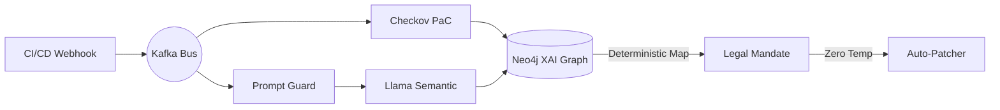

<div align="center">

# 🛡️ S E N T I N E L &nbsp; G R C &nbsp; `v2.1`

**Event-Driven Explainable Continuous Governance and Autonomous Remediation for DevSecOps**

<p align="center">
  
  
  
  
</p>

<p align="center">
  
  
  
</p>

> Bridging the gap between automated DevOps pipelines and qualitative European cybersecurity law through deterministic Explainable AI (XAI) and closed-loop local code patching.

</div>

---

## 🏛️ Executive Summary

The stringent enforcement of the **NIS2 Directive**, the **EU AI Act**, and the **General Data Protection Regulation (GDPR)** has introduced a critical operational bottleneck in DevSecOps, widely identified as the *Compliance Gap*. High-velocity cloud infrastructure is deployed at a rate that renders manual governance audits obsolete. Concurrently, utilizing cloud-hosted Generative AI for compliance translation introduces unacceptable data residency violations and non-trivial hallucination risks.

**Sentinel-V2.1** resolves this dichotomy. It is a Zero-Trust, event-driven orchestration engine that achieves **Explainable Continuous Governance (ECG)**. By decoupling deterministic technical vulnerability detection from qualitative semantic analysis, and mapping findings through a deterministic Neo4j Compliance Graph, Sentinel-V2.1 establishes verifiable transparency with a mathematically proven **0.0% legal hallucination rate**. 

Furthermore, version 2.1 introduces **Sovereign Autonomous Remediation**, empowering a constrained, zero-temperature local **Llama-3** agent to autonomously rewrite and patch vulnerable infrastructure code based strictly on deterministic graph mandates without human intervention or data egress.

---

## 🏗️ System Architecture

Sentinel-V2.1 operates on a highly scalable, asynchronous microservice architecture designed to execute natively within CI/CD pipelines without blocking high-velocity deployment runners.



| Component | Technology | Function |
| :--- | :--- | :--- |
| **Deterministic Engine** | `Checkov` | Evaluates the Abstract Syntax Trees (AST) of Terraform and Kubernetes manifests for baseline cyber-hygiene failures. |
| **Semantic Engine** | `Local Llama-3` | Conducts qualitative reviews of software dependency trees via a Prompt Firewall to catch 'Shadow AI' and telemetry risks. |
| **XAI Translation Core** | `Neo4j Graph` | Traverses a fixed property graph to map technical triggers directly to hardcoded legal articles (`NIS2 Art. 21`, `EU AI Act Art. 10`, `GDPR Art. 28/32`). |
| **Sovereign Remediation** | `Local Llama-3` | Executes local code patching at `temperature: 0.0` to rewrite non-compliant IaC code following strict graph mandates. |
| **Command Center** | `FastAPI / WebSockets` | Streams real-time pipeline telemetry, graph traversals, and remediation states straight to a dashboard interface. |

---

## 🛠️ Quick Start & Installation

### ⚡ Fast Track: Clone-and-Play (Fully Dockerized)

If you want to test the entire pipeline immediately without installing Ollama or Python dependencies locally, run the architecture inside a self-contained virtualization stack. 

> **Note:** This will automatically pull the required local weights on boot.

```bash
docker compose -f docker-compose.standalone.yml up -d
```

---

<details>
<summary><b>⚙️ Advanced: Local Manual Setup (Click to expand)</b></summary>
<br>

#### 1. System Prerequisites
* **Python:** 3.10 or higher.
* **Docker Desktop:** Required to host local Kafka, Zookeeper, and Neo4j containers.
* **Ollama:** Installed and running locally.

#### 2. Initialize Environment

```bash
git clone [https://github.com/shafincyber/Sentinel-GRC.git](https://github.com/shafincyber/Sentinel-GRC.git)
cd Sentinel-GRC
python -m venv venv

# Windows (PowerShell)
.\venv\Scripts\Activate.ps1
# Linux/macOS
source venv/bin/activate

pip install -r requirements.txt
```

#### 3. Boot Local Infrastructure

```bash
ollama pull llama3
docker compose up -d
```

*(Wait ~30 seconds for the Kafka broker and Neo4j to fully initialize and bind their communication ports).*

#### 4. Seed the XAI Compliance Graph

Populate the Neo4j graph with the human-verified tri-framework regulatory matrix.

```bash
python seed_neo4j.py
```

</details>

---

## 🚀 Execution & Usage

To simulate the event-driven architecture locally, open three separate terminal windows. *Ensure your virtual environment is active in all of them.*

**📟 Terminal 1: Start the API Gateway (Producer)**
```bash
python src/orchestrator/main.py
```

**📟 Terminal 2: Start the Kafka Worker & Remediation Engine (Consumer)**
```bash
python src/orchestrator/worker.py
```

**📟 Terminal 3: Trigger the CI/CD Webhook**
```powershell
Invoke-RestMethod -Uri 'http://localhost:8000/api/v2/scan' -Method Post -Headers @{'Content-Type'='application/json'} -Body '{"repository_url": "shafincyber/ecommerce-api", "commit_hash": "production-release"}'
```

> **👀 Observation:** Monitor **Terminal 2** or load `src/ui/dashboard.html` in your browser to watch real-time dual-layer scans, Neo4j graph traversals, WebSocket log streaming, and structural IaC file modifications enforced by the autonomous patcher.

---

## 📊 Benchmarks & Evaluation

Evaluated against a synthesized suite of 5,000 Infrastructure-as-Code templates and 2,000 software manifests, Sentinel-V2.1 demonstrated the following technical performance metrics on consumer-grade laptop hardware (16GB RAM, 6GB VRAM):
* **Compliance Mapping Accuracy:** 98.4% via optimized Cypher queries.
* **Legal Hallucination Rate:** 0.0% enforced by a fail-closed graph lookup mechanism.
* **Semantic Analysis Engine:** Achieved an F1-Score of 0.86 with a low 4.2% False Positive Rate.
* **Pipeline Overhead Latency:** Sub-5-second total processing time (1.8s p95 for deterministic scans, 4.8s p95 for local LLM text generation and code patching).

---

## 🤝 Contributing

Contributions are highly encouraged! We are specifically looking for help expanding the Neo4j Compliance Graph to support additional global frameworks like **DORA**, **ISO 27001**, and **NIST SP 800-53**. 

Please read our [`CONTRIBUTING.md`](CONTRIBUTING.md) for guidelines on branching strategies, commit messaging standards, and pull requests.

## 📄 License

This project is licensed under the MIT License - see the [`LICENSE`](LICENSE) file for details.